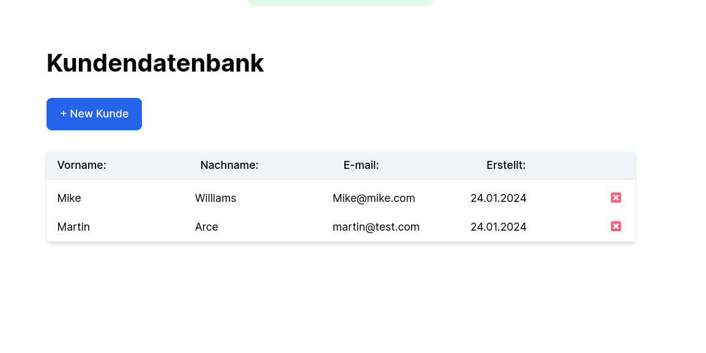
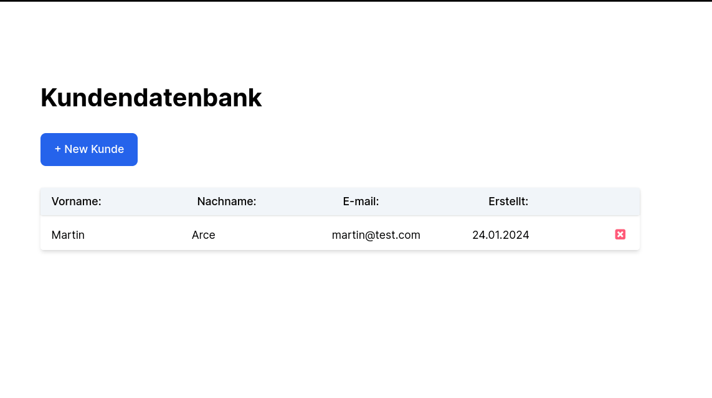
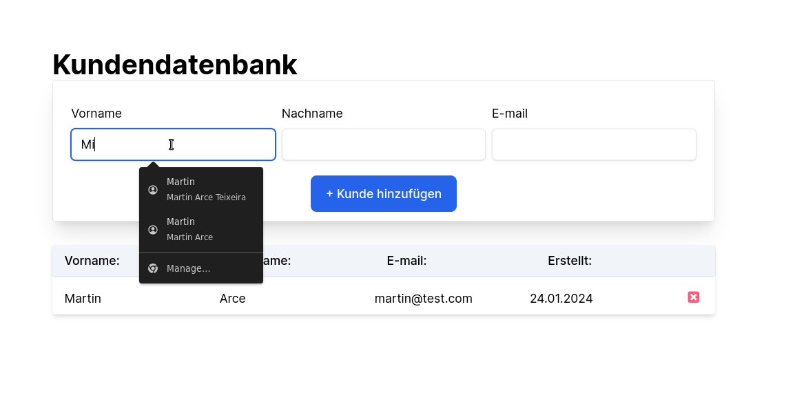
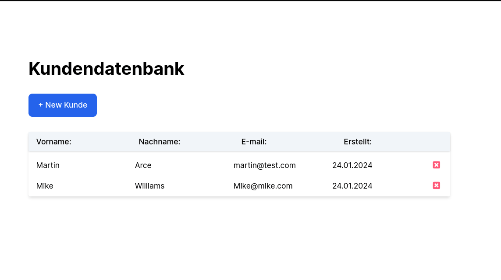

# Take-home project - Full Stack Entwickler

Entwickle eine simple Ruby on Rails-Anwendung für eine Kundendatenbank, die es ermöglicht, Kunden hinzuzufügen. 

Implementiere dabei eine Dublettenprüfung während des Anlegeprozesses. Die konkrete Umsetzung der Dublettenprüfung liegt in deiner Verantwortung.

Beschreibe deine Überlegungen und präsentiere dein Ergebnis in einem sinnvollen Format.

Du solltest zur Umsetzung weniger als 2 Stunden benötigen.

## Stack:
- Ruby on Rails 7.1
- PostgreSQL
- Turbo Hotwire/StimulusJS
- MiniTest

## Projekt 
Das Projekt erlaubt das Hinzufügen und Entfernen von Kunden in einer Datenbank. Dabei wird darauf geachtet, dass E-Mail-Adressen eindeutig sind, um Doppelungen zu verhindern. 

Diese Überprüfung erfolgt sowohl auf der Model-Ebene als auch auf der Datenbankebene. Auf der Model-Ebene wird ein eigener Prüfer genutzt(app/validators/email_validator), um sicherzustellen, dass die E-Mail-Adressen den Regeln entsprechen. 

```
## app/models/customer.rb
class Customer < ApplicationRecord
  validates :email,
    presence: { message: "E-Mail darf nicht leer sein" },
    email: { message: "Dies ist keine gültige E-Mail-Adresse" },
    uniqueness: { case_sensitive: false, message: "Diese E-Mail-Adresse wird bereits verwendet" }
end
```


Zusätzlich wird auf Datenbankebene ein Index für die E-Mail-Adresse eingeführt, um Datenintegrität sicherzustellen und Abfragen effizienter zu machen. 

```
## db/schema.rb 
  create_table "customers", force: :cascade do |t|
    t.string "first_name"
    t.string "last_name"
    t.string "email", null: false
    t.datetime "created_at", null: false
    t.datetime "updated_at", null: false
    t.index ["email"], name: "index_customers_on_email", unique: true
  end
```


### Test
Um die Zuverlässigkeit der Funktionen sicherzustellen, gibt es einfache Tests mit Minitest. Diese überprüfen verschiedene Szenarien, um sicherzustellen, dass die Kundenverwaltung zuverlässig und fehlerfrei funktioniert, sowohl für die Controller-Prüfungen als auch für die Datenbank-Integrität.

```bash
$ rails test

Rebuilding...

Done in 556ms.
Running 9 tests in a single process (parallelization threshold is 50)
Run options: --seed 30131

# Running:

.........

Finished in 0.318354s, 28.2704 runs/s, 72.2465 assertions/s.
9 runs, 23 assertions, 0 failures, 0 errors, 0 skips
```

## Info
Author:
Martin Arce
Januar 2024

## Links
[Demo](https://kunden.fly.dev/)
[Repository](https://github.com/divagueame/kunden)

## Demo
**Email Unique**
Ein Beispiel für die Überprüfung eindeutiger E-Mail-Adressen.


**Flow**
Visualisierung eines Arbeitsablaufs oder Prozesses.


**Neuer Benutzer**
Demonstration der Benutzerregistrierung.



**Benutzer entfernen**
Beispiel für das Entfernen eines Benutzers aus dem System.

